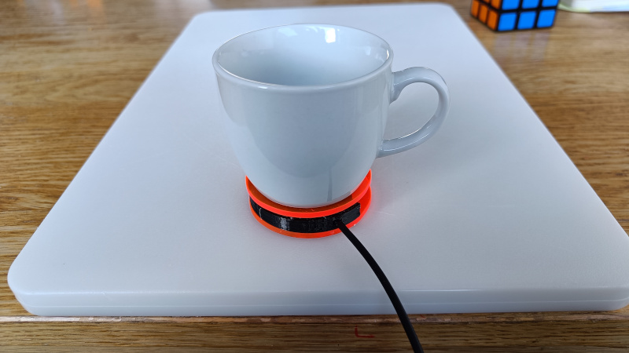
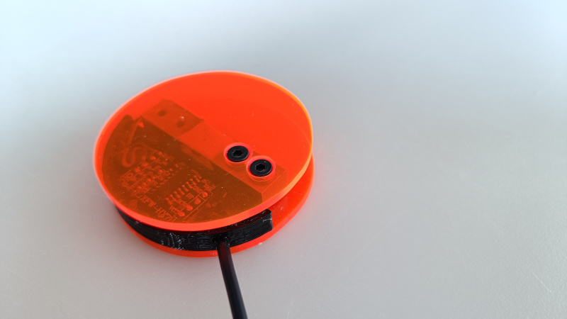
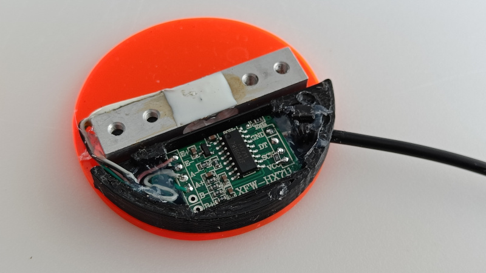
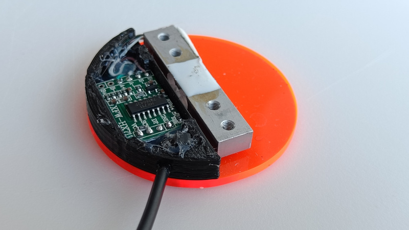
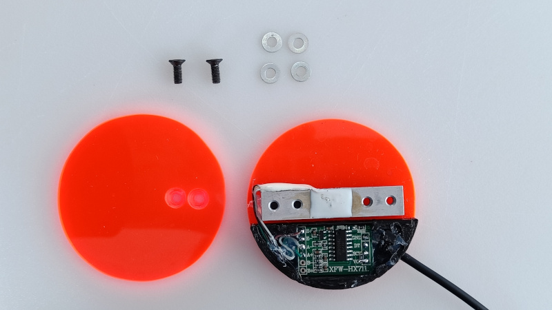
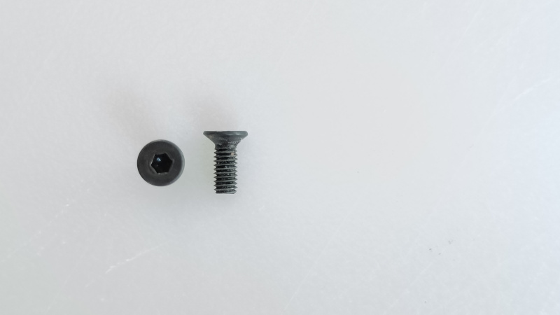
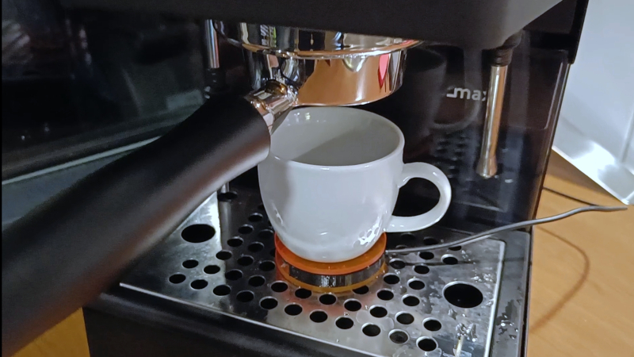
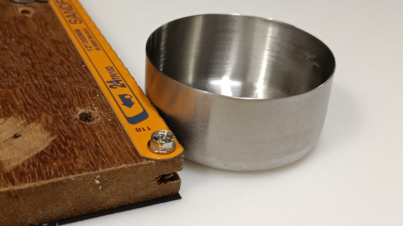
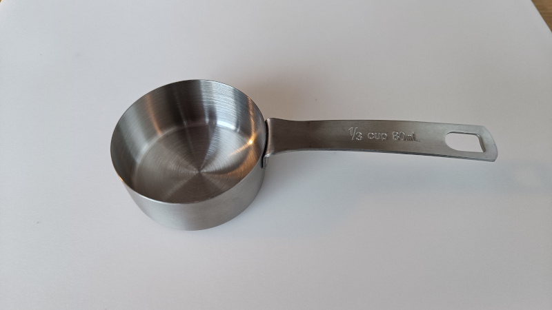

# Single Loadcell Scale (Work in progress!!)
Single loadcell scale for the awsome Gaggiuino project. It is work in progress so it may not work for you! The pcb holder is made in FreeCAD, and I uploaded the source file.

Gaggiuino project: https://gaggiuino.github.io/

# Wiring diagram
Need to make a diagram
* Be sure to connect the data2 pin to ground, because the library used in Gaggiuino checks the port status. If it sees the port is HIGH, than it assumes two loadcells. This can happen when you leave the port "floating/ungrounded".
* Solder a 1K resistor between the VCC and SCK on the HX711 board. I used an SMD for this. (See pictures)
* Create a file called "extra_defines.ini" in de gaggiuino project root and add this:
```
[extra]
build_flags = 
  -DSINGLE_HX711_BOARD
```
# PCB holder (WIP!!!)
It's what I got right now, it isn't pretty, cause the design went trough various iterations. 
You need to add the "DynamicData" plugin in FreeCAD via the "Addon Manager".
* pcb-holder/Weegschaal_005.FCStd  [FreeCAD]

# Parts
* Cable (4-core, 80°C)
  - From old mouse, should be a higher temp wire ofcourse (need update)

* Micro JST 2.0 PH 5-Pin Connector plug
  - https://www.aliexpress.com/item/32855763468.html (for example)
* Stainless Steel Measuring Cup (80ml)
  - https://www.aliexpress.com/item/1005002115887879.html
* Load Cell Module Weight Sensor (300g) (Not available anymore!)
  - https://www.aliexpress.com/item/1005006024363708.html
* 1K resistor (SMD or THT)
* Dual Channel HX711 Weighing Pressure Sensor
  - https://www.aliexpress.com/item/1005005258484244.html
* 4x M3x8mm-Screw (ISO 10642?)
* 8x M3-Washer (ISO 7089?)
* Plexiglas
* 3M 15 VHB tape GPH110 pads
  - https://www.amazon.nl/dp/B09XFDRHXW
* 1K resistor

# Tools:

* JigSaw
* Drill
* Drillbit 3mm
* JST Crimping tool - PA-09  (Red)(1.0, 1.4, 1.6, 1.9) (Not cheap, works great)
* etc.

# Pictures







# CAP is also in progress
I'm currently thinking of sticking it on with heat resistant tape



