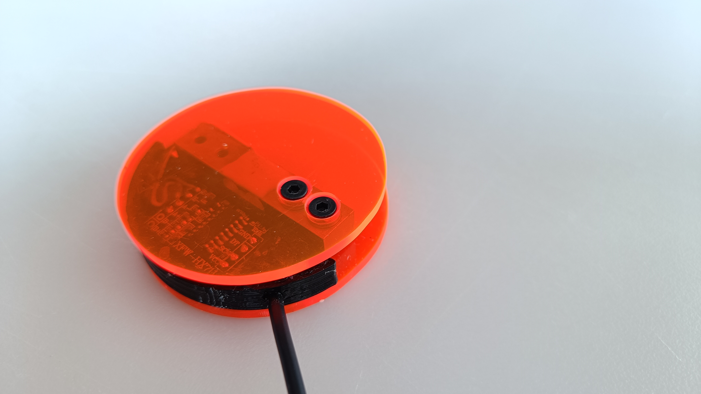

# Single Loadcell Scale (Work in progress!!)
Single loadcell scale for Gaggiuino

# Parts
* Cable (4-core, 80°C)
  - From old mouse, should be a higher temp wire ofcourse (need update)

* Micro JST 2.0 PH 5-Pin Connector plug
  - https://www.aliexpress.com/item/32855763468.html (for example)
* Stainless Steel Measuring Cup (80ml)
  - https://www.aliexpress.com/item/1005002115887879.html
* Load Cell Module Weight Sensor (300g) (Not available anymore!)
  - https://www.aliexpress.com/item/1005006024363708.html
* 1K resistor (SMD or THT)
* Dual Channel HX711 Weighing Pressure Sensor
  - https://www.aliexpress.com/item/1005005258484244.html
* 4x M3x8mm-Screw (ISO 10642?)
* 8x M3-Washer (ISO 7089?)
* Plexiglas

# Tools:

* JigSaw
* Drill
* Drillbit 3mm
* JST Crimping tool - PA-09  (Red)(1.0, 1.4, 1.6, 1.9) (Not cheap, works great)

